<div align="center">

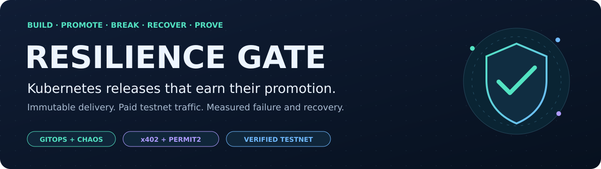

<h1>Resilience Gate</h1>

<p><strong>An immutable release. Real paid testnet traffic. Three dependency failures.<br/>One evidence-backed promotion decision.</strong></p>

[](https://github.com/devSatym/resilience-gate/actions/runs/37123284920)
[](https://github.com/devSatym/resilience-gate/releases/tag/v1.0.0)
[](docs/verification-report.md)
[](signer/test_permit2.py)
[](docs/known-limitations.md)

<p>
<a href="#see-the-platform">See the platform</a> ·
<a href="#architecture">Architecture</a> ·
<a href="#run-it-locally">Run locally</a> ·
<a href="docs/screenshots/README.md">Evidence gallery</a> ·
<a href="docs/verification-report.md">Verification report</a>
</p>

<p>
<a href="app/">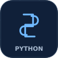</a>
<a href="docs/kubernetes-architecture.md"></a>
<a href="gke_terraform/">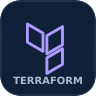</a>
<a href="kubernetes/argocd/"></a>
<a href="kubernetes/kargo/"></a>
<a href="helm/observability/"></a>
<a href="helm/observability/"></a>
<a href="kubernetes/chaos-experiments/">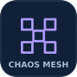</a>
<a href="docs/design/payment-contract.md">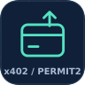</a>
</p>

</div>

Resilience Gate is a platform-engineering project built around a small FastAPI
URL shortener. The application carries the release through a complete GCP and
Kubernetes delivery system: keyless image publication, Cosign signatures,
Kargo Freight, rendered GitOps branches, external secrets, paid x402 traffic,
controlled chaos, fail-closed scoring, recovery, and verified cleanup.

The release question is concrete: **can this exact candidate serve useful
traffic, tolerate bounded dependency faults, recover, and leave the lab clean?**
The staging gate turns that question into a machine-readable verdict before
the candidate becomes eligible for the production-like testnet Stage.

> [!NOTE]
> **Verified snapshot: 3 October 2026.** The `v1.0.0` application Freight
> completed dev → staging → `prod` on the existing two-node owned GKE lab.
> `prod` means **production-like testnet** throughout this repository.
> Exact source, chart, render, image and analysis identities are in the
> [verification report](docs/verification-report.md).

## The engineering behind the verdict

| Release concern | Implemented contract |
| --- | --- |
| **Know exactly what shipped** | OCI digest, Git source, rendered revision, signer and gate runtime identities travel with the evidence. GitHub OIDC publishes without a stored cloud key; Cosign signs and verifies the image. |
| **Promote configuration with the candidate** | Kargo renders manifests to `env/dev`, `env/staging`, and `env/prod`. Argo CD reconciles those outputs. Dev auto-promotes; staging and prod require operator promotion. |
| **Prove useful traffic first** | The gate checks the ready target and exclusive Lease, then uses the suspended load source to establish paid traffic before injecting a fault. |
| **Measure the failure and recovery** | Serial PostgreSQL, Redis and signer pod-failure experiments must show a real outage, bounded errors and latency, then recovery. |
| **Fail when evidence is incomplete** | Empty, stale, malformed, non-finite or insufficient telemetry fails the scorecard. A dependency that never goes down also fails the experiment. |
| **Make cleanup part of success** | A successful gate Job also requires verified cleanup of its Workflow, fault objects, load Job and Lease; the final audit checks WorkflowNodes and other residual resources. |

## See the platform

Release orchestration, running workloads, recovery and payments—captured from
the owned lab. Click any screenshot to inspect its original resolution;
the [reviewed gallery](docs/screenshots/README.md) records each image's exact scope.

### One release through three Stages

[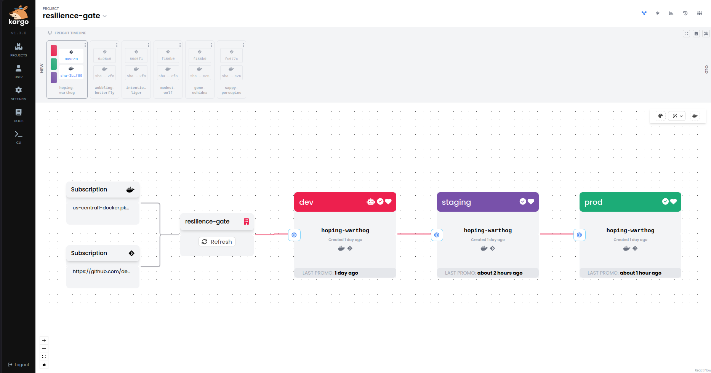](docs/screenshots/assets/10-kargo-pipeline-final.png)

The final **3 October** pipeline shows `hoping-warthog` in all three Stages.
The production-like Argo CD application reconciled `env/prod` revision
`7d334d5` with all three application replicas Ready.

### GitOps delivery, down to the running Pods

[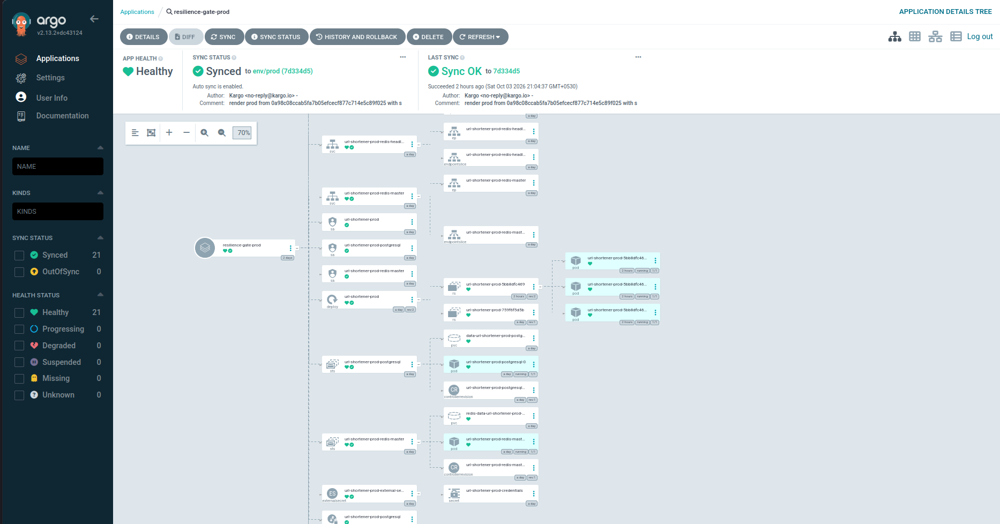](docs/screenshots/assets/29-argocd-prod-resource-tree.png)

**Fresh release · 3 October.** The prod-like application is `Synced` and
`Healthy`: 21 green resources, three Ready application Pods, and rendered
revision `7d334d5`. This is owned-testnet delivery, not a public-production claim.

### Failure, traffic and recovery in the same time window

[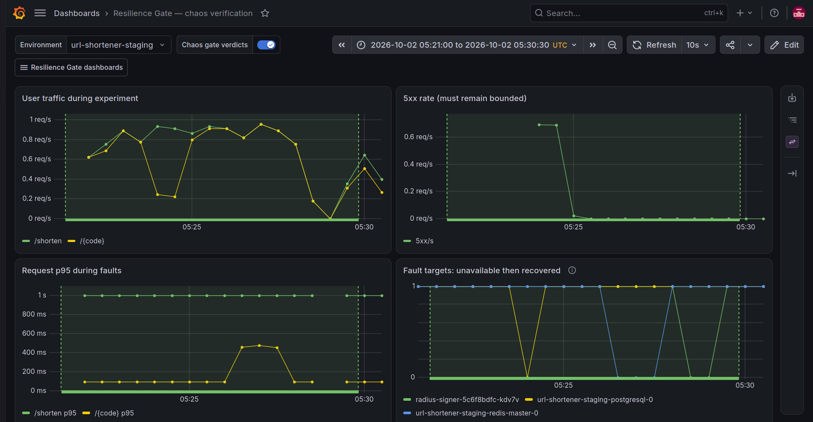](docs/screenshots/assets/17-grafana-chaos-overview.png)

This is the **2 October historical successful run**, displayed over its exact
UTC window. PostgreSQL, Redis and signer outage/recovery traces are correlated
with paid traffic, 5xx rate and route p95. The fresh **3 October** candidate
passed a separate gate; its identities and scorecards are recorded in the
[verification report](docs/verification-report.md).

### Paid traffic, settlement and signer readiness

[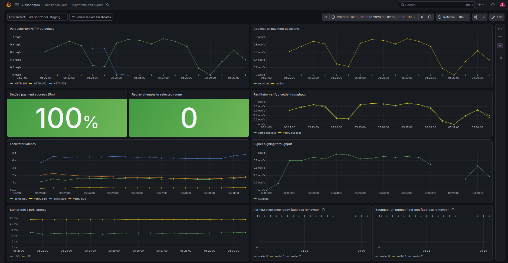](docs/screenshots/assets/23-grafana-payment-settlement.png)

**Historical recovery · 2 October, 05:21:00–05:30:30 UTC.** The dashboard shows
`100%` settlement success and zero replay attempts within that window, alongside
facilitator latency and signer throughput. Wallet readiness uses `wallet_index`,
not addresses. A separate sanitized HTTP smoke recorded
**`402 → signed 201 → redirect 302 → replay 409`**; it is not the dashboard's
zero-replay-attempt observation.

<details>
<summary><strong>Inspect the green PASS, red FAIL, blocked candidate and run-scoped logs</strong></summary>

#### The fresh staging gate returns an explicit PASS

[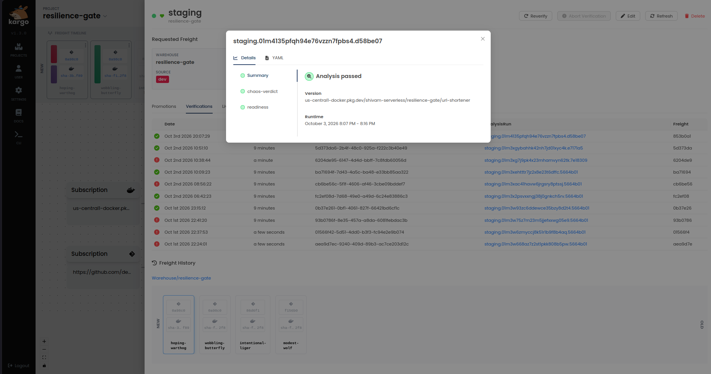](docs/screenshots/assets/11-kargo-analysisrun-pass.png)

**Fresh release · 3 October.** The staging AnalysisRun passed both `readiness`
and `chaos-verdict` during `14:37:29–14:46:28 UTC`. Its exact identity and Kargo
verification-history mapping are in the
[fresh-release gallery](docs/screenshots/README.md#the-fresh-v100-release).

#### Readiness alone cannot turn a failed gate green

[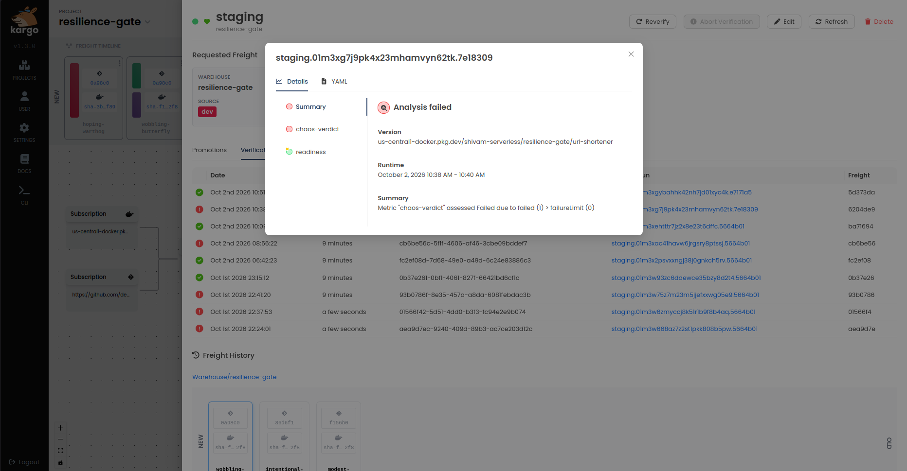](docs/screenshots/assets/12b-kargo-staging-failed-metrics.png)

**Historical negative scenario · 2 October.** `intentional-liger` passed
readiness but failed `chaos-verdict` during paid-traffic preflight. Fault
injection never began, and staging verification did not pass. This is a
different candidate and run from the fresh green PASS above.

#### A failed staging candidate stays ineligible

[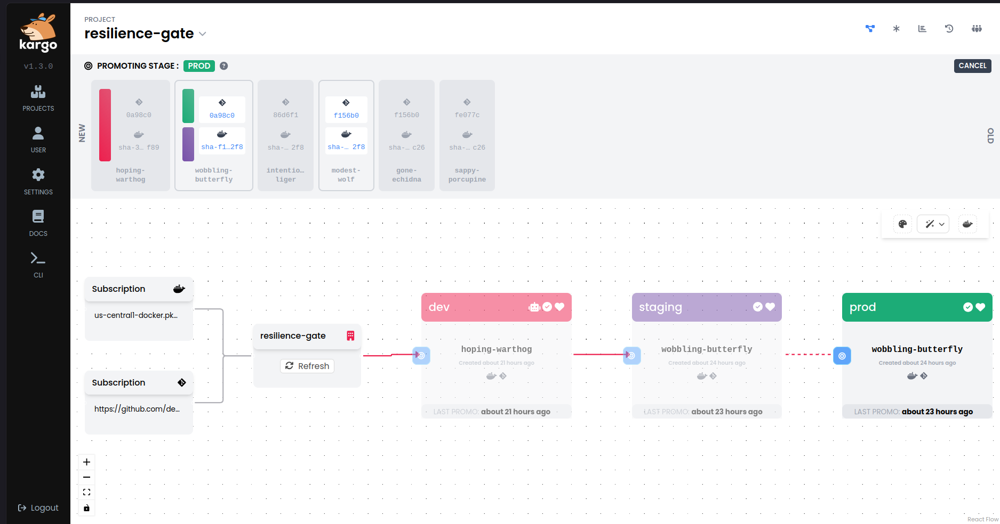](docs/screenshots/assets/13-kargo-prod-ineligible-freight.png)

Historical Freight `intentional-liger` failed staging and was verified only in
dev. Kargo v1.3 disables it in the normal prod promotion selector. The capture
was cancelled without creating an approval or Promotion.

#### The logs connect degradation, PASS and application stability

[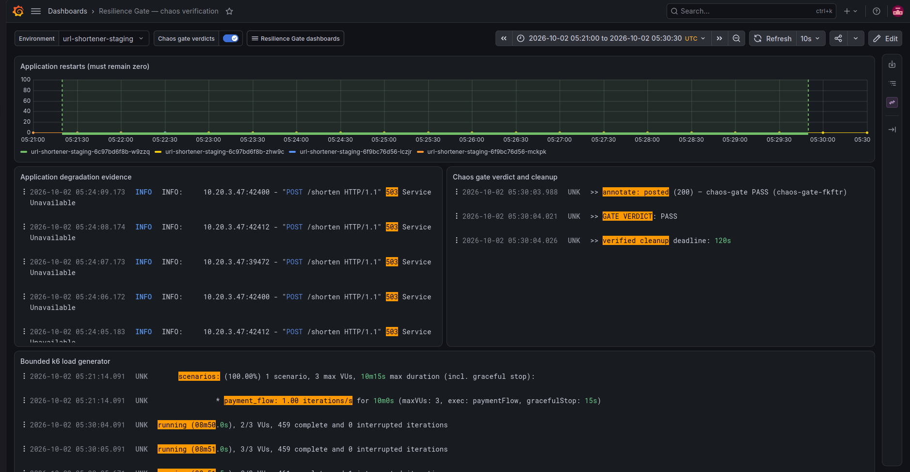](docs/screenshots/assets/17b-grafana-chaos-evidence.png)

**Historical recovery · 2 October, 05:21:00–05:30:30 UTC.** The companion view
shows zero application restarts, scoped `/shorten` degradation, an explicit
`GATE VERDICT: PASS`, cleanup logging and bounded paid-load excerpts. It belongs
to the same earlier candidate as the recovery charts; the fresh release's
cleanup audit is recorded separately in the verification report.

</details>

**[Open the complete gallery →](docs/screenshots/README.md)** · 29 canonical
captures + 5 detail companions, with narrow captions and explicit historical
windows. Screenshots illustrate the platform; sanitized metadata and
scorecards carry the run identities and verdicts.

## Architecture

[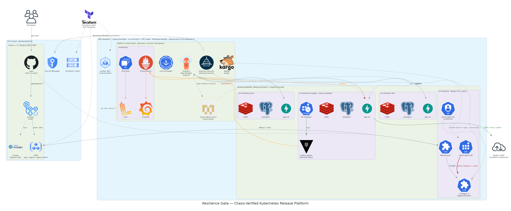](docs/kubernetes-architecture.md)

[View the original platform diagram at full size](docs/diagrams/01-platform-architecture.png).

The original design diagrams are retained unchanged. Embedded names, sizing,
namespaces, replica counts and the Promtail label reflect an earlier setup;
the [current architecture](docs/kubernetes-architecture.md) and
[verification report](docs/verification-report.md) document the deployed
topology and results.

| Owner | Responsibility |
| --- | --- |
| **Terraform** | VPC, zonal GKE Standard, node identity, Artifact Registry, OIDC federation and IAM. |
| **Argo CD** | Continuous reconciliation of platform controllers and rendered environment manifests. |
| **Kargo** | Freight discovery, environment rendering, staged promotion and verification. |
| **External Secrets Operator** | Secret materialization from GCP Secret Manager through Workload Identity. |
| **Gate runner** | One bounded staging run: Lease, load, serial faults, scorecards and cleanup. |
| **Prometheus · Grafana · Loki · Alloy** | Metrics, dashboards and logs used to observe and score the run. |

### The promotion path

[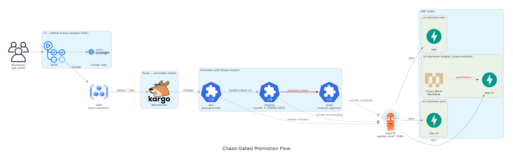](docs/design/promotion-contract.md)

Successful staging verification makes the Freight eligible for downstream
selection. The prod-like promotion then performs Argo CD sync plus readiness
and liveness checks; it does not repeat the paid chaos run.

<details>
<summary><strong>Inside the fail-closed gate</strong></summary>

[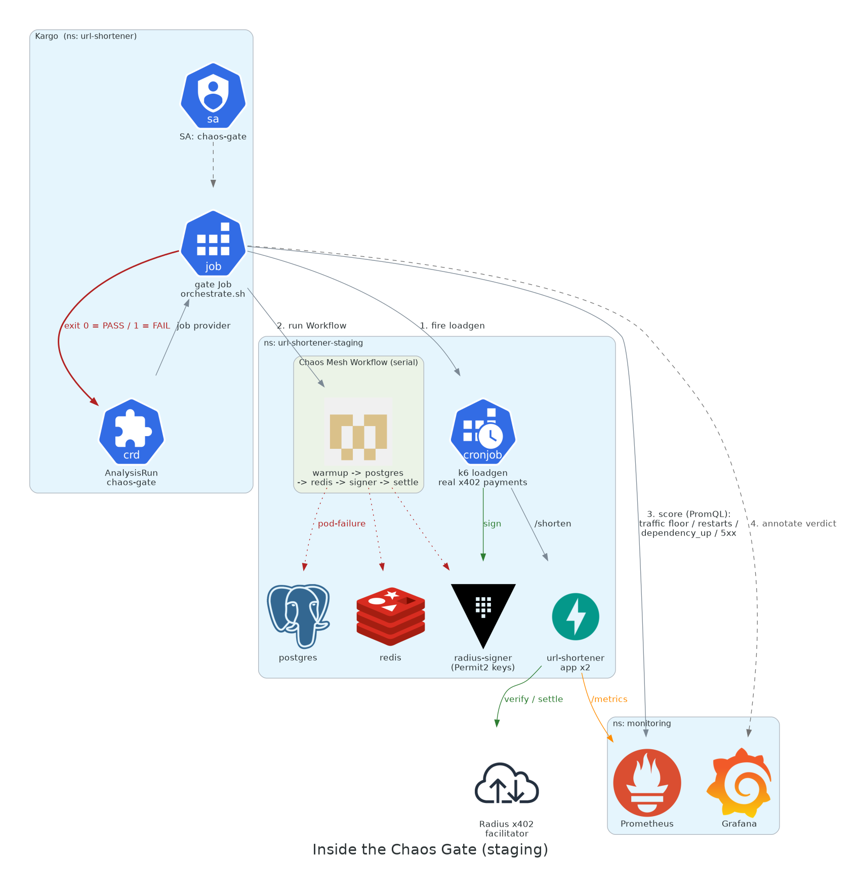](docs/diagrams/03-chaos-gate.png)

| Guard | Verdict when the contract cannot be proven |
| --- | --- |
| Target is unready or another run holds the Lease | Block before fault injection. |
| Paid traffic cannot be established | Fail before injecting a meaningless fault. |
| Telemetry is missing, stale or malformed | Fail; never interpret missing data as a healthy zero. |
| A fault never becomes observable | Fail the vacuous experiment. |
| The dependency does not recover | Fail the scenario. |
| Run-scoped cleanup cannot be confirmed | The gate Job fails even if its scoring verdict was PASS; retain evidence for investigation. |

See the [failure model](docs/design/failure-model.md) and
[chaos-gate runbook](docs/runbooks/chaos-gate.md).

</details>

<details>
<summary><strong>Inside the x402 / Permit2 payment path</strong></summary>

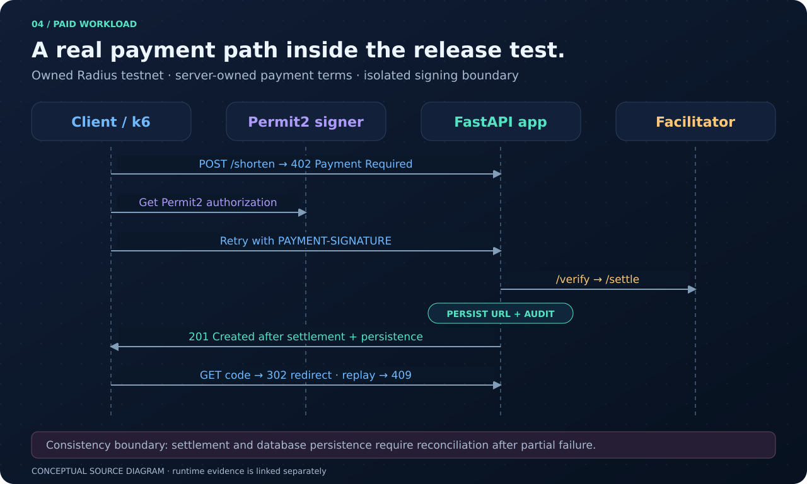

`POST /shorten` charges for new URL creation. The server owns the payment
terms; an isolated signer supplies a Permit2 authorization; the application
asks the testnet facilitator to verify and settle before persisting the URL.
A unique settlement identity prevents application-level replay.

The health model supports recovery: `/livez` is process-only, `/ready` requires
PostgreSQL, and Redis can fall back to PostgreSQL after initial readiness.
`/metrics` exposes request, dependency and payment signals.

See the [payment contract](docs/design/payment-contract.md) for HTTP behavior,
signer boundaries and settlement/persistence consistency limits.

</details>

## What the recorded validation proves

| Check | Recorded result |
| --- | --- |
| **Source validation** | 231 project tests passed; 1 integration test intentionally deselected locally. 13 signer tests passed. Helm, Terraform, Kustomize, shell, Compose and diagram checks passed. |
| **CI** | The latest audited `main` validation run passed at `7ea5e91`; CI also exercises the marked local recovery integration test and builds all three runtime images. |
| **Fixed lab** | Two `e2-standard-4` nodes, GKE Standard, Workload Identity; the fresh staging/prod campaign created or resized no cloud resources. |
| **Reconciliation and secrets** | Eight Argo CD Applications healthy/synced; all nine ExternalSecrets ready; populated Prometheus target pools up. |
| **Fresh staging gate** | Freight `d3b4380…` passed PostgreSQL, Redis and signer scorecards on 3 October; readiness and `chaos-verdict` succeeded. |
| **Fresh prod-like promotion** | The same Freight passed readiness/liveness, synced render `7d334d5`, and reached 3/3 Ready application replicas. |
| **Negative behavior** | Retained historical failures demonstrate blocking, insufficient paid traffic, missing telemetry, no-target and timeout/cleanup contracts within their recorded scope. |
| **Cleanup** | No residual run-scoped load, Chaos Mesh resources or gate Lease; the load-source CronJob remained suspended. |

The [`v1.0.0` application release](https://github.com/devSatym/resilience-gate/releases/tag/v1.0.0)
is at `3b70835`; the chart source carried by the fresh Freight is `0a98c08`.
Platform source `7ea5e91` includes the later observability corrections. These
are distinct identities, all recorded in the
[verification report](docs/verification-report.md) and
[evidence index](docs/evidence/README.md). A historical pass does not validate
a later candidate automatically.

## Run it locally

Start with the source contracts. Prerequisites: Python 3.12, Docker with
Compose, Helm, Terraform and `kubectl` with Kustomize support.

```bash
git clone https://github.com/devSatym/resilience-gate.git
cd resilience-gate

python3 -m venv .venv
.venv/bin/python -m pip install -r requirements-dev.txt
.venv/bin/python -m pip install -r signer/requirements.lock

PYTHON=.venv/bin/python make test
PYTHON=.venv/bin/python make validate
```

Validation may download pinned dependencies when uncached. It does not apply
infrastructure or start a live testnet run. The
[offline walkthrough](docs/demo-walkthrough.md) explains what each check proves.

For an end-to-end local unpaid application and Redis-recovery smoke:

```bash
make smoke-local
```

This builds the Compose stack, creates and resolves a URL, temporarily stops
Redis, verifies liveness and steady-state readiness, then removes the local
containers and disposable volumes. See
[local development](docs/runbooks/local-development.md).

<details>
<summary><strong>Explore the owned testnet operator tools</strong></summary>

Public operator identifiers are rendered from an ignored local config:

```bash
make config
$EDITOR platform_setup_scripts/config.env
make render-config
git diff -- kubernetes/
```

Review configuration changes before deployment. Secret values belong in GCP
Secret Manager. Planning and read-only entry points include:

```bash
./scripts/lab-ops.sh status
./scripts/lab-ops.sh bootstrap-plan
./scripts/run-loadgen.sh --plan --duration 10m --vus 3
./scripts/validate-live.sh --plan --scenario chaos-gate
```

Bootstrap, paid traffic, chaos, promotion and teardown use explicit
acknowledgements and exact-context checks. Follow the
[lab lifecycle](docs/runbooks/lab-lifecycle.md),
[load-testing](docs/runbooks/load-testing.md),
[payment](docs/runbooks/testnet-payments.md) and
[chaos-gate](docs/runbooks/chaos-gate.md) runbooks.

</details>

## Find your way through the repository

```text
app/                         FastAPI URL shortener, health and x402 enforcement
signer/                      Isolated Permit2 signing service
helm/url-shortener/          Workload chart and dev / staging / prod profiles
helm/observability/          Prometheus, Grafana, Loki, Alloy and dashboards
kubernetes/argocd/           Root GitOps application
kubernetes/apps/             AppProject and environment ApplicationSet
kubernetes/bootstrap/        Platform Applications and secret-store contracts
kubernetes/kargo/            Warehouse, Stages, promotion and analysis templates
kubernetes/jobs/             Suspended load source and signer workload
kubernetes/chaos-experiments/  Workflow, RBAC, orchestrator and scorer
docker/gate-runner/           Digest-pinned gate runtime
gke_terraform/               GCP and GKE foundation
platform_setup_scripts/      Guarded bootstrap and read-only verification
scripts/                     Validation, evidence, load and lifecycle tools
schemas/                     Evidence and scorecard schemas
tests/                       Application, platform, GitOps and gate contracts
docs/                        Design, diagrams, gallery, runbooks and evidence
```

## Go deeper

| If you want to… | Read |
| --- | --- |
| Understand component ownership and failure boundaries | [Kubernetes architecture](docs/kubernetes-architecture.md) · [configuration reference](docs/configuration-reference.md) |
| Review how a signed artifact becomes an environment | [Artifact identity](docs/design/artifact-identity.md) · [promotion contract](docs/design/promotion-contract.md) |
| Inspect payment and resilience decisions | [Payment contract](docs/design/payment-contract.md) · [failure model](docs/design/failure-model.md) |
| Reproduce the safe local walkthrough | [Offline demo](docs/demo-walkthrough.md) · [local development](docs/runbooks/local-development.md) |
| Audit the recorded results | [Verification report](docs/verification-report.md) · [evidence index](docs/evidence/README.md) · [screenshot gallery](docs/screenshots/README.md) |
| Evaluate the next production engineering steps | [Known limitations](docs/known-limitations.md) |

This is a completed owned-testnet platform demonstration with explicit limits:
one zonal cluster, bounded sequential pod-failure scenarios, lab-sized data and
observability services, and operator-controlled consequential promotions.
Mainnet payments, financial custody, multi-region availability and compliance
certification remain outside its verified scope.

<div align="center">

**Identify the candidate. Exercise the failure. Measure recovery. Verify cleanup.**

[Documentation](docs/README.md) · [Evidence gallery](docs/screenshots/README.md) · [Release](https://github.com/devSatym/resilience-gate/releases/tag/v1.0.0)

</div>
