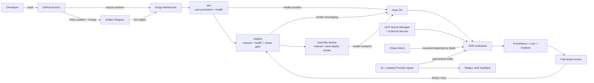

# Resilience Gate — Chaos-Verified Kubernetes Release Platform

> A production-style GitOps platform that promotes an immutable Kubernetes
> release only after it proves health, paid-traffic readiness, bounded
> dependency-failure tolerance, recovery, and cleanup.

[](app/)
[](docs/kubernetes-architecture.md)
[](kubernetes/)
[](gke_terraform/)
[](kubernetes/chaos-experiments/)
[](docs/design/payment-contract.md)

Resilience Gate is an end-to-end platform-engineering project built around a
deliberately small FastAPI URL shortener. The application is only the payload.
The project demonstrates the harder release-engineering work around it:
immutable artifact identity, keyless CI publication, rendered-environment
GitOps, staged promotion, external secret delivery, observability, paid
testnet traffic, controlled chaos, fail-closed scoring, recovery, and
auditable evidence.

> [!NOTE]
> **Verified on 2 October 2026 in a private, owned GCP testnet lab.** The full
> dev → staging → production-like path completed successfully. This is a
> scoped testnet verification, not a mainnet, public-production, compliance,
> or financial-custody claim. See the
> [verification report](docs/verification-report.md).

## What was verified

| Area | Verified result |
| --- | --- |
| Source quality | 230 project tests passed, 1 intentionally deselected; 13 signer tests passed; Helm, Terraform, Kustomize, shell, Compose, and diagram checks passed. |
| Cloud platform | Two Ready `e2-standard-4` nodes in a zonal GKE Standard cluster with Workload Identity. |
| GitOps | All eight Argo CD Applications were `Synced` and `Healthy`. |
| Promotion | Kargo `dev`, `staging`, and production-like `prod` Stages were `Steady`; their latest verifications were `Successful`. |
| Workloads | Dev ran 1 app replica, staging 2 plus the signer, and prod 3; PostgreSQL and Redis were Ready in every environment. |
| Baseline | Bounded dev traffic passed: 44.89 requests observed, zero 5xx responses, 95 ms p95 latency, and healthy dependencies. |
| Paid testnet path | The staging smoke observed `402 → signed 201 → redirect 302 → replay 409` without emitting wallet, signature, payment-header, or transaction identifiers. |
| Negative gate | A deliberately degraded staging candidate failed before fault injection because paid traffic could not be proven. It did not advance. |
| Chaos and recovery | PostgreSQL, Redis, and signer pod-failure scenarios passed fail-closed scorecards and a clean re-verification. |
| Prod-like promotion | Kargo promotion succeeded; readiness and liveness analyses passed; Argo CD reconciled the digest-pinned render; 3/3 app replicas were Ready. |
| Cleanup | No residual Workflow, WorkflowNode, PodChaos, run-scoped Job, or Lease remained after validation. |
| Evidence hygiene | 16 metadata records and 238 retained files passed schema, raw-name, symlink, sensitive-pattern, and encoded-data audits. |

Five consecutive GitHub validation runs for the final source/fix sequence also
passed. Exact revisions, run identifiers, evidence boundaries, and the final
inventory are recorded in the
[verification report](docs/verification-report.md).

## Why this project is different

Many demo pipelines stop at “the container built” or “the pod is Ready.” This
platform makes a narrower and more useful release claim:

1. **The candidate is identifiable.** Git source, OCI digest, rendered branch,
   running workload, signer, load generator, and gate runner are bound to
   immutable identities.
2. **The deployed configuration travels with the release.** Kargo renders
   plain Kubernetes YAML to `env/dev`, `env/staging`, and `env/prod`; Argo CD
   reconciles those outputs instead of rendering mutable `main` directly.
3. **Useful traffic exists before a fault begins.** The gate refuses to inject
   chaos when the target, paid traffic, telemetry, or exclusive Lease cannot
   be proven.
4. **Dependency failures are measured.** Chaos Mesh removes PostgreSQL, Redis,
   and signer pods in bounded serial experiments while Prometheus supplies the
   scoring window.
5. **Missing evidence fails closed.** Empty, stale, malformed, non-finite, or
   insufficient telemetry cannot silently become a passing zero.
6. **Cleanup is part of the verdict.** A run does not pass until its exact
   Workflow, load Job, PodChaos objects, and Lease are confirmed absent.

## Architecture



The platform separates ownership deliberately:

- Terraform owns the GCP foundation: VPC, zonal GKE Standard cluster, node
  identity, Artifact Registry, OIDC federation, and IAM.
- Argo CD owns continuously reconciled platform and environment resources.
- Kargo owns candidate discovery, rendered environment branches, promotion,
  and verification.
- External Secrets Operator owns secret materialization from GCP Secret
  Manager through Workload Identity.
- The chaos-gate Job owns one bounded run and only its run-scoped resources.

Read the full [Kubernetes architecture](docs/kubernetes-architecture.md) and
[configuration reference](docs/configuration-reference.md) for the ownership
and configuration contracts.

## Release path

```text
reviewed source + OCI digest
        │
        ▼
Kargo Warehouse discovers Freight
        │
        ▼
dev ── service-health verification ── PASS
        │
        ▼ manual promotion
staging ── readiness + paid load + bounded chaos + scorecards + cleanup ── PASS
        │
        ▼ manual promotion
prod-like testnet ── Argo CD sync + readiness + liveness ── PASS
        │
        ▼
scoped evidence-backed testnet release claim
```

Dev is the only auto-promoted Stage. Staging and prod-like transitions remain
explicit operator actions. A candidate that fails verification remains useful
negative evidence, but it cannot become downstream Freight through the normal
path.

## Inside the chaos gate

The staging AnalysisRun launches one digest-pinned gate-runner Job. Its
orchestrator:

1. validates the source revision and image digest;
2. acquires a Kubernetes Lease to prevent concurrent gates;
3. confirms a ready target and a suspended load-source CronJob;
4. starts a uniquely named, bounded k6 Job;
5. proves paid traffic before fault injection;
6. runs serial PostgreSQL, Redis, and signer pod-failure experiments;
7. scores traffic, dependency-down, error, latency, and recovery signals;
8. optionally annotates Grafana; and
9. deletes and verifies only the resources created for that run.

| Guard | Failure behavior |
| --- | --- |
| No ready target | Block before fault injection. |
| Another gate owns the Lease | Block instead of overlapping experiments. |
| Paid traffic is absent | Fail before injecting a meaningless fault. |
| Telemetry is missing or stale | Fail the scorecard; never infer a healthy zero. |
| Dependency never fails | Fail because the experiment was vacuous. |
| Dependency does not recover | Fail the scenario. |
| Cleanup is uncertain | Retain a failing verdict for investigation. |

See the [failure model](docs/design/failure-model.md),
[chaos-gate runbook](docs/runbooks/chaos-gate.md), and retained
[evidence index](docs/evidence/README.md).

## Application and payment path

The workload is a URL-shortening API backed by PostgreSQL and Redis:

- `GET /livez` is process-only and does not turn a dependency outage into a
  restart loop.
- `GET /ready` checks the required dependency state.
- `GET /metrics` exports application and payment signals for Prometheus.
- `POST /shorten` returns an x402 v2 challenge when payment is required.
- An isolated Permit2 signer creates authorizations without exposing private
  keys to the application or load generator.
- The application asks the testnet facilitator to verify and settle before it
  persists the shortened URL.
- A unique settlement identifier prevents application-level replay.

The payment path is deliberately testnet-only. The observed smoke verifies the
HTTP and application replay contract for one bounded execution; it does not
claim custody controls, mainnet support, or universal settlement finality.

## Technology map

| Layer | Technology | Responsibility |
| --- | --- | --- |
| Application | Python 3.12, FastAPI, SQLAlchemy, PostgreSQL, Redis | URL creation, redirects, health semantics, persistence, metrics, and payment enforcement. |
| Payment boundary | x402 v2, Permit2, isolated FastAPI signer | Server-owned payment terms, EIP-712 authorization, settlement, and replay handling. |
| Packaging | Docker, Helm, Kustomize | Reproducible images, environment overlays, hardened pod defaults, and rendered manifests. |
| Infrastructure | Terraform, GCP, GKE Standard, Artifact Registry | Network, cluster, node pool, workload identity, image registry, IAM, and OIDC federation. |
| CI and supply chain | GitHub Actions, Workload Identity Federation, Cosign | Credential-free validation, immutable publication, signing, verification, and identity records. |
| GitOps | Argo CD app-of-apps and ApplicationSet | Continuous reconciliation of platform resources and rendered environment branches. |
| Promotion | Kargo, Argo Rollouts AnalysisTemplates | Freight discovery, staged rendering, explicit promotion, and health/chaos verification. |
| Secrets | GCP Secret Manager, External Secrets Operator | Keyless secret delivery without committed Kubernetes Secret data. |
| Observability | Prometheus, Grafana, Loki, Alloy | Metrics, dashboards, logs, and the evidence used by scoring. |
| Resilience | Chaos Mesh, k6, custom Python scorer | Bounded dependency faults, paid traffic, fail-closed scorecards, and recovery verification. |

## Repository map

```text
app/                         FastAPI URL shortener and x402 enforcement
signer/                      Isolated Permit2 signing service
helm/url-shortener/          Workload chart and dev/staging/prod overlays
helm/observability/          Prometheus, Grafana, Loki, Alloy, dashboards
kubernetes/argocd/           Root GitOps application
kubernetes/apps/             AppProject and environment ApplicationSet
kubernetes/bootstrap/        Platform Applications and secret-store contracts
kubernetes/kargo/            Warehouse, Stages, promotion and analysis templates
kubernetes/jobs/             Suspended load source and signer workload
kubernetes/chaos-experiments/  Workflow, RBAC, orchestrator and scorer
docker/gate-runner/           Immutable chaos-gate runtime image
gke_terraform/               GCP and GKE foundation
platform_setup_scripts/      Guarded bootstrap and read-only verification
scripts/                     Validation, evidence, load and lifecycle tooling
schemas/                     Evidence and scorecard schemas
tests/                       Application, platform, GitOps and gate contracts
docs/                        Architecture, design decisions, runbooks and evidence
```

Private planning files and reusable local secret material are intentionally
excluded through `.gitignore`; they are not part of the public project surface.

## Run locally

Prerequisites: Python 3.12, Docker with Compose, Helm, Terraform, and `kubectl`
with Kustomize support.

```bash
python3 -m venv .venv
.venv/bin/python -m pip install -r requirements-dev.txt
.venv/bin/python -m pip install -r signer/requirements.lock

# Hermetic tests; integration/live markers remain opt-in.
PYTHON=.venv/bin/python make test

# Helm, Terraform, Kustomize, shell, Compose, application and signer checks.
PYTHON=.venv/bin/python make validate

# Optional local unpaid Postgres/Redis recovery smoke.
make smoke-local
```

`make validate` may download pinned dependencies when they are not cached. It
does not apply Terraform, mutate Kubernetes, start paid traffic, or run chaos.
The [offline demo](docs/demo-walkthrough.md) explains those boundaries.

## Operate the private testnet lab

Public operator configuration is local and ignored:

```bash
make config
$EDITOR platform_setup_scripts/config.env
make render-config
git diff -- kubernetes/
```

Review the rendered public identifiers before any mutating phase. Secret
values belong in GCP Secret Manager, never in `config.env`, command arguments,
manifests, evidence, or Git.

Useful guarded entry points:

```bash
# Read-only live state.
./scripts/lab-ops.sh status

# Dry-run the bootstrap sequence.
./scripts/lab-ops.sh bootstrap-plan

# Review a load run without contacting the cluster or testnet.
./scripts/run-loadgen.sh --plan --duration 10m --vus 3

# Review a Kargo verification request without executing it.
./scripts/validate-live.sh --plan --scenario chaos-gate
```

Mutating bootstrap, paid traffic, promotions, chaos, and teardown require
their explicit acknowledgements and exact target-context checks. Start with
the [lab lifecycle](docs/runbooks/lab-lifecycle.md),
[load-testing](docs/runbooks/load-testing.md), and
[chaos-gate](docs/runbooks/chaos-gate.md) runbooks.

## Engineering decisions worth reviewing

- [Artifact identity](docs/design/artifact-identity.md) — digest-first delivery,
  keyless signing, identity records, and registry retention.
- [Promotion contract](docs/design/promotion-contract.md) — rendered branches,
  Kargo ownership, manual boundaries, and Argo CD synchronization.
- [Payment contract](docs/design/payment-contract.md) — server-owned x402 terms,
  Permit2 signing, facilitator handling, replay, and consistency limits.
- [Failure model](docs/design/failure-model.md) — what pass, fail, blocked, and
  unavailable mean, including telemetry and cleanup boundaries.
- [Known limitations](docs/known-limitations.md) — the intentionally narrow
  testnet scope and what this project does not claim.

The complete documentation map is in [docs/README.md](docs/README.md).

## Project status

The implementation, private GCP deployment, baseline, paid staging smoke,
negative regression gate, healthy chaos run, recovery exercise, and
production-like promotion have been completed and verified for the stated
testnet scope. Operational state can drift after the recorded snapshot, so
future changes must run the same validation and evidence process again.

No mainnet or public-production release is implied. `prod` in this repository
always means **production-like testnet**.
