# Resilience Gate architecture

**Status: implemented and verified in the private owned-testnet lab.** The
source and manifests below were exercised through dev baseline, staging paid
traffic, negative gating, healthy chaos, recovery, and a production-like
promotion. The October 2 campaign established the historical baseline,
payment, negative, and recovery results; a fresh October 3 run verified
`v1.0.0` Freight through staging chaos and prod-like smoke. The
[verification report](verification-report.md) captures both candidates with
their exact identities and evidence boundaries. The
[diagram collection](diagrams/README.md) and
[screenshot gallery](screenshots/README.md) provide the visual tour.

Resilience Gate is deliberately testnet-only. A directory or namespace called
`prod` represents a production-like testnet boundary, never a mainnet or
public-production release.

## System intent

The platform is designed to promote an immutable workload identity through
reviewed environments only after the configured checks for that stage succeed.
It separates four concerns:

| Concern | Implemented contract | Verified observation |
| --- | --- | --- |
| Workload | `app/` implements a FastAPI URL shortener; `signer/` is a separate Permit2-signing boundary. | Dev/staging/prod workloads were Ready; the staging paid smoke completed its challenge, settlement, redirect, and replay sequence. |
| Delivery | Helm values accept digest-qualified image identities, while Kargo templates render environment branches. | All three rendered branches were reconciled; eight Argo CD Applications were Synced/Healthy. |
| Verification | The chaos gate binds source and workload identity to one bounded Job/Workflow and fail-closed scorecards. | All three October 3 `v1.0.0` dependency scorecards passed; the historical degraded candidate failed before chaos when paid traffic was absent. |
| Evidence | Schemas, collectors, sanitizers, and retained summaries bind each result to the observed run. | October 2 historical audit: 16 metadata records / 238 files. October 3: two new privately retained bundles / 36 files, plus 34 reviewed screenshots. |

## Configured component map

### Application and dependency behavior

The URL-shortener chart declares the application alongside PostgreSQL and
Redis dependencies. Its application process exposes a deliberately narrow
health distinction:

- `/livez` is process-only, so a dependency outage should not cause a
  dependency-driven restart loop.
- `/ready` checks PostgreSQL and checks Redis before the first successful
  readiness result; it returns an unavailable response when those required
  checks cannot be made.
- `/metrics` exports Prometheus metrics for the application contract.

When payment settings are complete, `POST /shorten` requires an x402 v2
`PAYMENT-SIGNATURE`. The application constructs payment terms from deployment
configuration, asks a configured facilitator to verify and settle the
authorization, and persists a validated settlement transaction identifier
with the new URL. An unavailable facilitator maps to an availability failure;
malformed or rejected authorization does not create a URL. The separate signer
process exposes a limited `POST /sign-permit2` API and keeps private keys out
of the load client and application process. See
[the payment contract](design/payment-contract.md) and
[the x402 design note](design/x402-migration.md).

These are code and chart contracts. They are not observations of a reachable
database, cache, signer, facilitator, or chain.

### Bootstrap, GitOps, and promotion configuration

`platform_setup_scripts/` treats local `config.env` as ignored operator input.
`render_config.py` renders public repository, project, registry, and cluster
identifiers into reviewable manifests before any bootstrap phase is allowed to
use them. The bootstrap scripts also define an exact Kubernetes-context check
for mutating phases. Neither an ignored local file nor a rendered manifest is a
provisioning record.

The GitOps design has two paths:

1. The Argo CD root application follows `main` for bootstrap resources such as
   observability and the gate configuration.
2. The ApplicationSet follows `env/dev`, `env/staging`, and `env/prod` for
   rendered workload output. Those branches are Kargo outputs; they are not
   inputs to the source-of-truth `main` branch.

The Kargo Project is named `resilience-gate`. Its policy declares development
as the only automatic stage, while staging and the production-like testnet
stage require an explicit promotion. The Warehouse may discover a constrained
`sha-*` tag, but stage templates render the Freight's OCI digest into the
environment values. The production-like Stage is active and retains its
explicit manual-promotion boundary.

Cosign verification belongs to CI publication. The configured Warehouse and
deployment path do not independently verify signatures or require CI's
identity record; digest pinning preserves the selected content. See
[artifact identity](design/artifact-identity.md) for that trust boundary.

### Observability configuration

The local `helm/observability` chart pins Prometheus, Loki, and Alloy chart
dependencies in its lock file. It configures a reviewed namespace allowlist of
ServiceMonitors, Prometheus retention/storage, Loki single-binary filesystem
storage, and Alloy Kubernetes API log discovery. The dashboards and log/metric
targets are useful only after the chart is actually installed and its sources
are producing data; a rendered dashboard does not prove collection or alerting
works.

Four focused Grafana dashboards separate application health, chaos evidence,
Kubernetes runtime state, and payment/signer telemetry. Chaos logs are scoped
to the gate container in the `resilience-gate` namespace. Payment readiness
queries remove wallet address labels before Grafana receives the series.

### Bounded chaos verification design

The staging stage references both service-health and chaos-gate analyses. The
gate runner is designed to require a release revision and digest, acquire a
run-scoped Lease, reject an absent ready target or another active run, start
bounded load, prove paid traffic from the exact load Job, create the constrained
workflow, score its telemetry, and verify cleanup on exit. Prometheus evidence
is evaluated during scoring rather than probed before fault injection. Its
scorer treats empty, malformed, non-finite, insufficient,
or stale telemetry as evidence failure rather than a healthy zero.

The production-like stage uses post-deploy liveness and readiness checks after
its upstream staging boundary. That separation is intentional: a post-deploy
smoke check cannot replace a prior chaos-gate result. The recorded final path
successfully executed both layers in order for the fresh October 3 Freight.
The runner's successful exit depends on cleanup of its Workflow, fault objects,
load Job, and Lease. The final independent audit additionally checks residual
WorkflowNodes and active controller operations.

## Intended promotion path

The following is the configuration flow. The recorded verification followed
this route; the diagram itself is explanatory rather than evidence.

```mermaid
flowchart LR
  source[Reviewed source on main] --> identity[Source revision + OCI digest]
  identity --> warehouse[Kargo Warehouse discovery]
  warehouse --> dev[dev: configured automatic policy]
  dev --> devhealth[service-health analysis]
  devhealth --> staging[staging: manual promotion]
  staging --> stghealth[service health]
  staging --> gate[bounded chaos gate]
  stghealth --> verified[staging verification succeeds]
  gate --> verified
  verified --> prod[prod-like testnet: manual promotion]
  prod --> smoke[post-deploy health smoke]

  source --> render[rendered env branches]
  render --> argo[Argo CD environment Applications]
  argo --> workload[Digest-pinned workload manifests]

  workload -. metrics and logs, when installed .-> observe[Prometheus / Loki / Grafana]
  observe -. evidence for scorer .-> gate
```

Kargo's render step and Argo CD reconciliation are distinct controls. The
former writes a digest-bound rendered revision; the latter applies the desired
revision. Both identities must be recorded before a later live evidence claim
can be reproduced.

## Promotion failure modes

| Failure or ambiguity | Design response in source | Remaining limit |
| --- | --- | --- |
| Public identifiers are absent, unrendered, or inconsistent. | The renderer and bootstrap preflight are designed to reject unresolved or unsafe input before mutation. | The named owned-lab path used one reviewed rendering; rejection of every invalid-input variant remains source/test coverage. |
| Current kube context is wrong. | Mutating bootstrap phases require the configured GKE context exactly. | Context checks do not prove that the target itself is safe or funded. |
| A tag moves after candidate discovery. | The Warehouse discovers constrained tags, but stage templates use `imageFrom(...).Digest` for rendered workload identity. | A digest still needs a real build, signature verification, retention, and live record. |
| An application process is alive while a dependency is unavailable. | Liveness and readiness are separate; readiness can remove an unready endpoint without asserting the process is dead. | The recorded gate observed selected PostgreSQL, Redis, and signer faults/recovery only; it does not cover all workload failure modes. |
| Payment authorization is invalid or the facilitator is unavailable. | The app rejects invalid authorization and treats facilitator transport/response failure as unavailable rather than settled. | A sanitized paid-smoke receipt records `402 → signed 201 → redirect 302 → replay 409`; it remains a bounded testnet observation rather than custody or production-payment assurance. |
| Telemetry is missing, stale, malformed, or non-finite. | The scorer fails closed rather than interpreting missing data as zero. | A scorer-only unreachable-endpoint test failed closed; it is not a shared-Prometheus outage or full-gate exercise. |
| The chaos target is absent, an older run remains, or another run owns the Lease. | The orchestrator is designed to stop before fault injection. | The nonexistent-service direct test blocked before fault injection; concurrency behavior remains uncollected. |
| A workflow times out or cleanup cannot be verified. | The final result is forced to fail when run-scoped resources cannot be confirmed absent. | A one-second direct timeout test invoked cleanup; default-duration timeout behavior remains uncollected. |
| A candidate is manually patched outside the normal path. | Evidence rules require source, render, image, gate, and runtime identities to agree. | Review discipline still matters; manifests cannot make an undocumented patch auditable. |
| A required release scenario has not run. | The correct state is unavailable/not collected, not pass. | The historical campaign collected baseline, deliberate regression, recovery, and prod-like smoke; October 3 separately verified the fresh release, and future candidates need their own records. |

## Explicit trade-offs

- **Fail closed over uninterrupted promotion.** Missing telemetry, a held Lease,
  or cleanup uncertainty blocks a candidate. This increases investigation work
  but avoids mistaking absence of data for resilience.
- **Digest identity over tag convenience.** Digests improve traceability, while
  discovery tags remain convenient. The cost is more identity handling and
  retention discipline.
- **Rendered branches over in-cluster Helm rendering.** A reviewed output can
  be inspected independently of Argo CD, but it introduces a controller-owned
  branch lifecycle that must not be merged back into `main`.
- **Separate signer boundary over a simpler load client.** Isolating private
  keys reduces their exposure surface, but adds startup/health dependencies to
  the payment test path.
- **Small, pinned observability deployment over high availability.** The chart
  configuration favors a bounded testnet lab and local storage footprint. It
  is not a high-availability or disaster-recovery design.
- **Testnet-only scope over real monetary assurance.** The source may model a
  payment flow without making a mainnet, custody, compliance, or production
  availability claim.

## Evidence required for every release claim

Every verified claim must connect the exact source revision, rendered revision,
workload digest, signer and gate-runner digests where applicable, target
context, test window, scorecards, and cleanup result. The evidence must come
from an explicitly approved owned lab. See [evidence handling](evidence/README.md),
[artifact identity](design/artifact-identity.md), and
[the evidence status directories](evidence/).

The historical October 2 campaign satisfied those conditions for its recorded
private testnet candidates. On October 3, fresh staging and prod-like
AnalysisRuns verified Freight `d3b4380…` with application digest `ab88d89c…`,
ending dev, staging, and prod on the same candidate. Historical and fresh
results remain distinct in the [verification report](verification-report.md)
and [gallery captions](screenshots/README.md). Neither result carries forward
automatically to a later candidate.
