# The release, in evidence

  <strong>34 reviewed captures · 29 canonical views · 5 detail companions</strong> 
  Signed artifacts → rendered Git → measured recovery → verified promotion

This gallery follows Resilience Gate from GitHub publication to a verified
production-like **Radius testnet** deployment. The images were captured on
2–3 October 2026 and reviewed individually for identity, readability, and
sensitive content. Click any image to inspect the original resolution.

[Release](#release-and-supply-chain) · [Cloud](#cloud-and-platform-health) ·
[GitOps](#the-fresh-v100-release) · [Blocked candidates](#when-the-gate-says-no) ·
[Recovery](#recovery-under-real-traffic) · [Payments](#the-paid-request-path) ·
[Cleanup](#cleanup-is-part-of-the-result)

## Read the evidence correctly

Two timelines appear here. **Fresh release alignment** refers to the
3 October `v1.0.0` staging verification and prod-like promotion. **Historical
scenario** refers to the earlier 2 October negative, recovery, and payment
runs. The historical dashboards show an earlier application digest; their
success must not be assigned to the fresh release by implication. Capture
time and execution time are recorded separately in the [portable manifest](manifest.json).

| Evidence boundary | Recorded identity |
| --- | --- |
| Release tag / application source | `v1.0.0` / `3b70835` |
| Fresh Freight | `d3b4380…` · `hoping-warthog` |
| Fresh application image | `sha256:ab88d89c…` |
| Fresh staging / prod render | `64d2dde` / `7d334d5` |
| Fresh staging analysis | `2026-10-03 14:37:29–14:46:28 UTC` · Successful |
| Fresh prod-like analysis | `2026-10-03 15:34:59–15:35:29 UTC` · Successful |
| Historical recovery analysis | `2026-10-02 05:21:11 UTC` start · `wobbling-butterfly` · `sha256:a5beda83…` |
| Verification authority | Exact AnalysisRun status, immutable identities, scorecards, and cleanup records |

Screenshots explain the observed result; the [verification report](../verification-report.md)
and [evidence index](../evidence/README.md) establish its scope. All `prod`
references below mean the owned testnet environment.

## Release and supply chain

### 01 · A named, immutable release

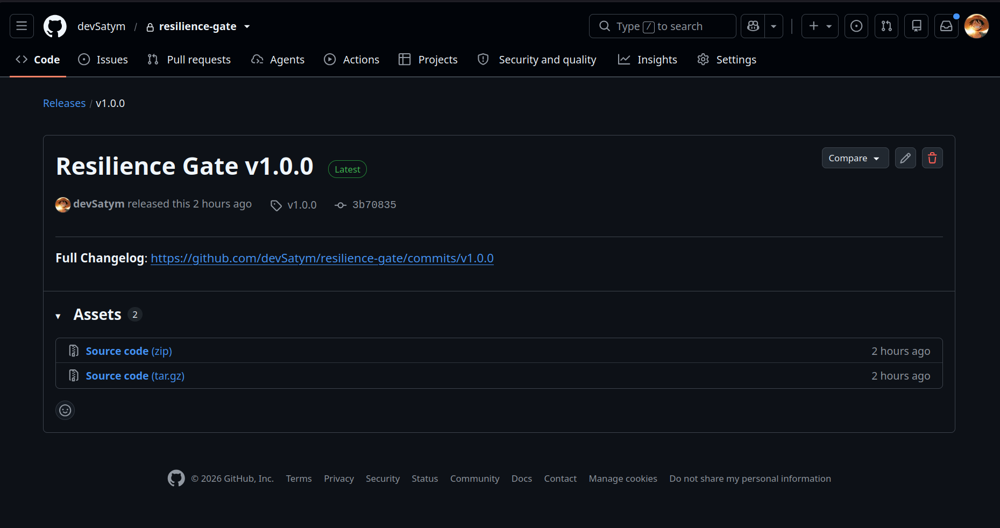

The published `v1.0.0` release identifies application source `3b70835`.
Captured **2 October, 10:15:13 UTC**. This is a release record, not a deployment verdict.

<strong>02–03 · Validation, OIDC publication, and signing</strong>

### 02 · Release workflow overview

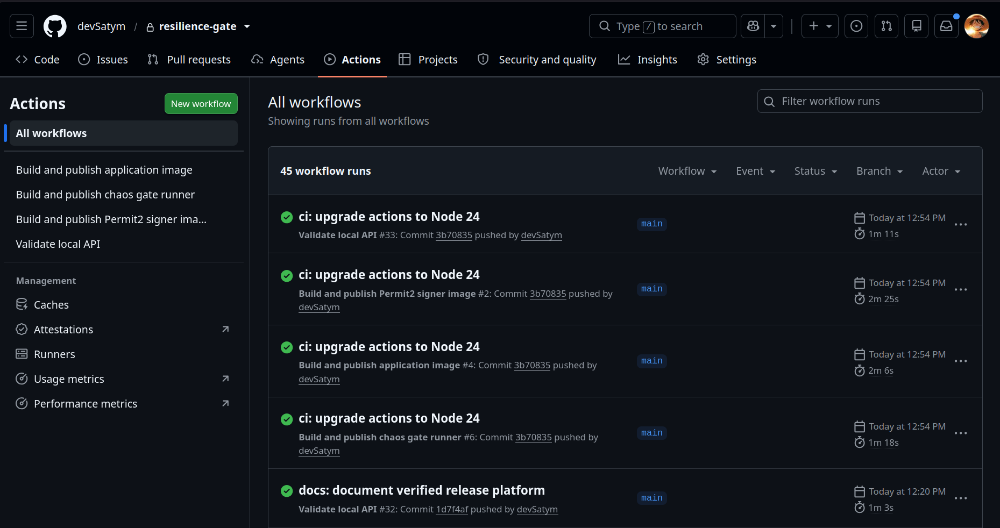

Four release workflows succeeded for the release commit. Captured
**2 October, 10:21:12 UTC**; later source changes have their own CI results.

### 03 · Keyless cloud identity and verified image publication

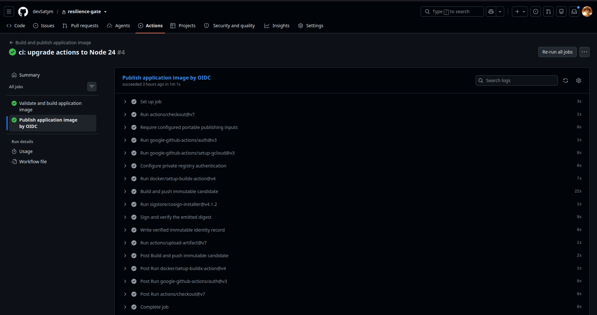

The accepted workflow view shows successful OIDC authentication, immutable
build/push, Cosign sign/verify, identity-record creation, and artifact upload.
Captured **2 October, 10:25:02 UTC**. Collapsed steps avoid exposing raw logs.

## Cloud and platform health

### 04 · A fixed, owned GKE lab

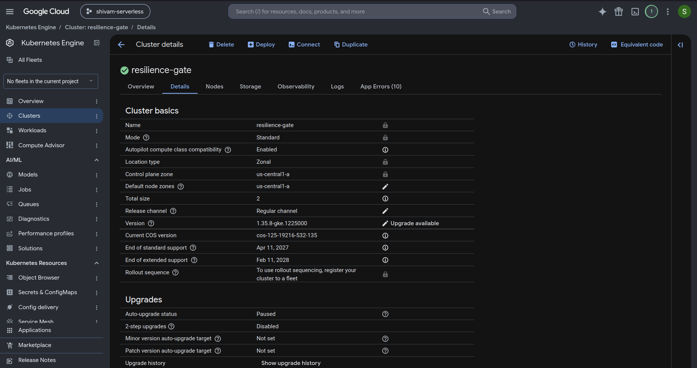

The Standard cluster in `us-central1-a` had two nodes at capture time.
Captured **2 October, 10:32:09 UTC**. The fresh validation later used this
existing capacity without creating or resizing cloud resources.

<strong>04b–07 · Workload identity, node management, and immutable artifacts</strong>

### 04b · GKE Workload Identity

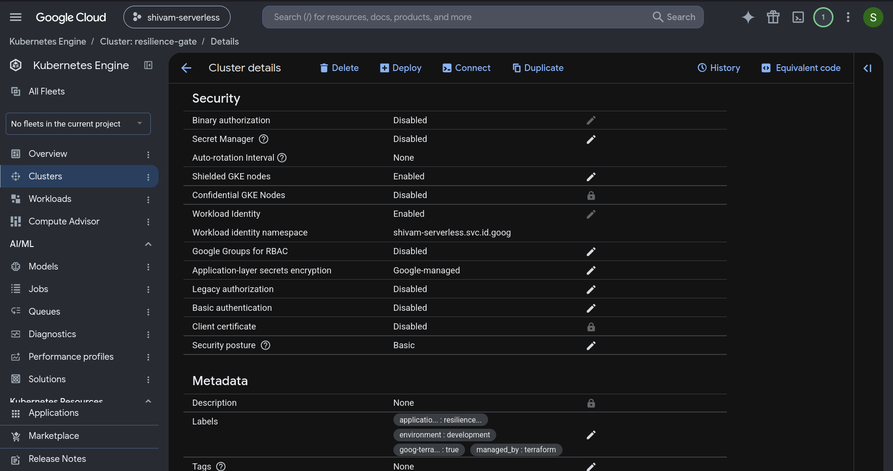

The companion captures the enabled workload identity setting. Captured
**2 October, 10:38:28 UTC**; it exposes configuration metadata, not credentials.

### 05 · Two-node pool

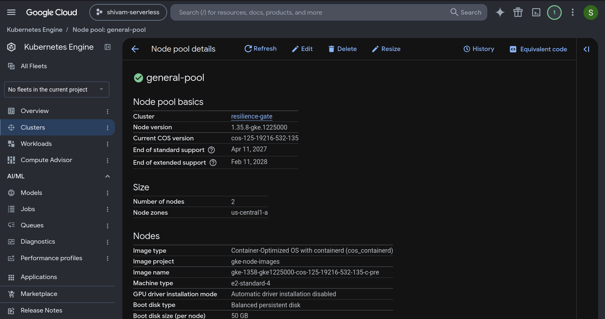

The pool has two `e2-standard-4` nodes. Captured **2 October, 10:42:25 UTC**.

### 05b · Node maintenance settings

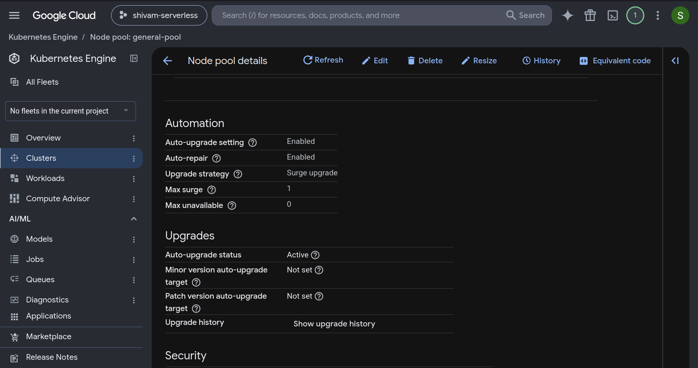

Auto-upgrade and auto-repair are enabled. Captured **2 October, 10:46:12 UTC**.
This detail view ends before service-account identity fields.

### 06 · Tags bound to release digests

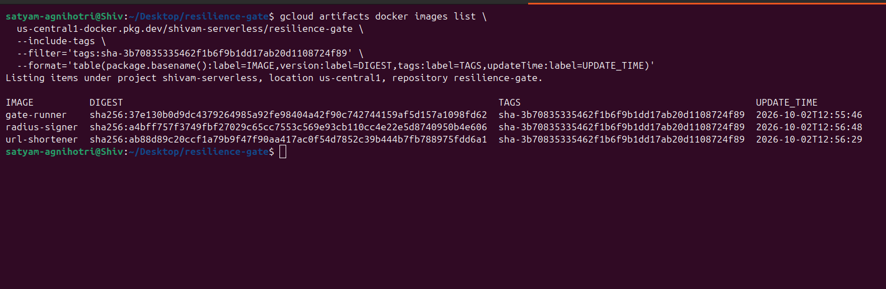

The application, signer, and gate-runner release images carry full release-SHA
tags and immutable OCI digests. Captured **2 October, 10:50:21 UTC**.

### 07 · A repository-scoped GitHub OIDC trust boundary

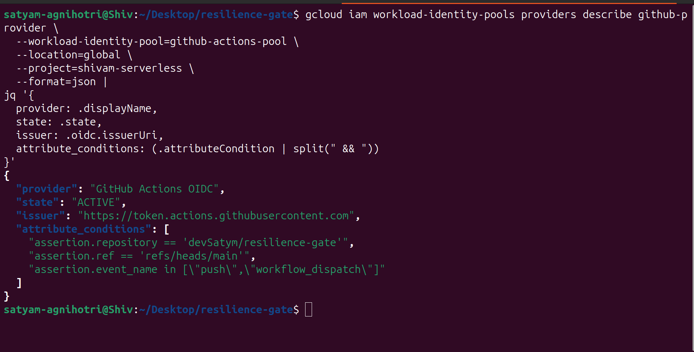

The active provider limits GitHub trust to this repository, `main`, and the
configured push/workflow-dispatch events. Captured **2 October, 11:13:19 UTC**.
The terminal view was chosen because the console did not expose a usable
provider-details link.

<strong>27–28 · Secret synchronization and healthy scrape pools</strong>

### 27 · ExternalSecrets are synchronized

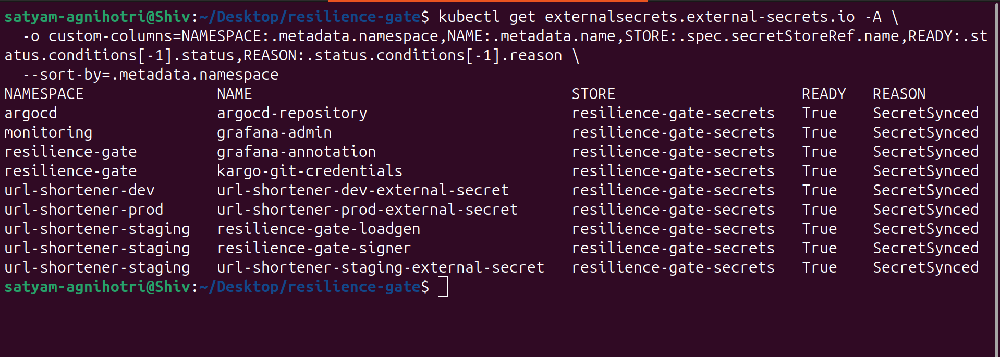

All nine ExternalSecrets report `True` / `SecretSynced`. Captured
**2 October, 11:28:12 UTC**. The output contains object status only, never Secret values.

### 28 · Populated Prometheus targets are up

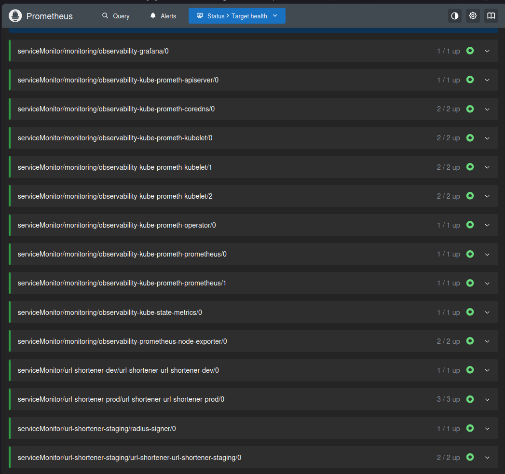

All populated scrape pools are green, including CoreDNS `2/2`, application
environments, signer, and platform exporters. Captured **2 October,
12:03:59 UTC**, after correcting the GKE CoreDNS metrics-port target.

## The fresh v1.0.0 release

### 10 · One Freight, three verified Stages

**Fresh release alignment.** The complete pipeline shows `hoping-warthog`
(`d3b4380…`) in dev, staging, and prod with green status indicators. Its
source/image artifacts link the selected Freight to the `v1.0.0` application.
Captured **3 October, 17:00:09 UTC**, after successful staging and prod-like verification.

<strong>08–09, 11 · Reconciliation and staging verification</strong>

### 08 · Platform-wide application overview

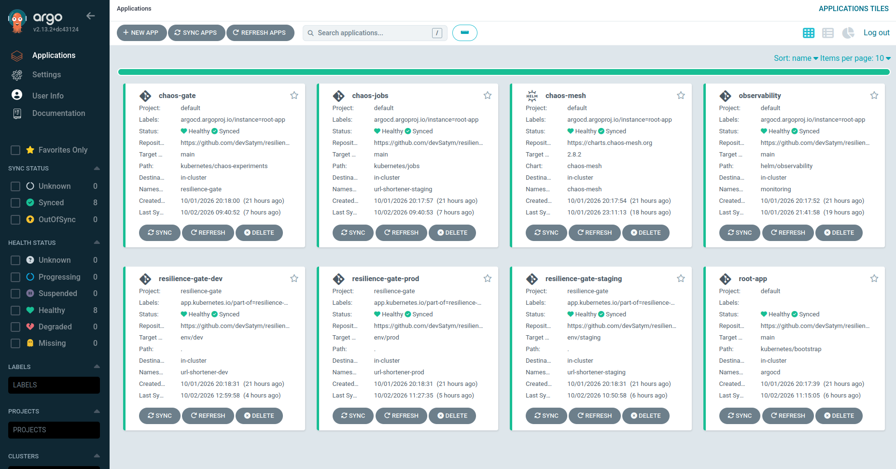

**Earlier configuration snapshot.** All eight Argo CD Applications are
`Healthy` and `Synced`. Captured **2 October, 11:20:19 UTC**, before the fresh
release alignment; this overview does not prove that every environment used
the later `v1.0.0` Freight at that time.

### 09 · Fresh staging resource tree

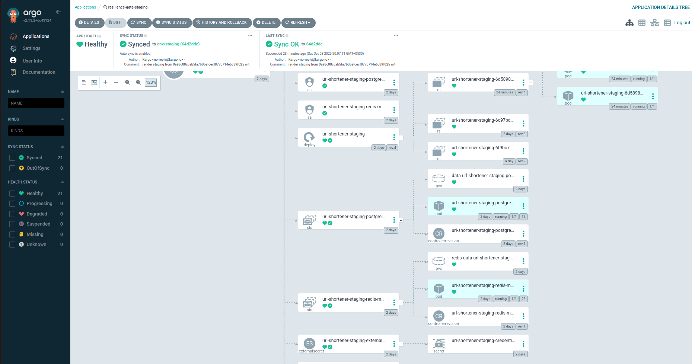

**Fresh release alignment.** Staging is `Healthy` / `Synced` at `64d2dde`,
with all 21 displayed resources green. Captured **3 October, 15:01:07 UTC**,
after the `14:37:29–14:46:28 UTC` staging analysis completed.

### 11 · The exact fresh staging AnalysisRun passed

**Fresh release alignment.** AnalysisRun
`staging.01m4135pfqh94e76vzzn7fpbs4.d58be07` passed both `readiness` and
`chaos-verdict`. Captured **3 October, 15:08:49 UTC**. Kargo v1.3 displays
`853b0a1` in the table's Freight column here; it is the verification-history
ID, live-mapped to Freight `d3b4380…`, not a second Freight object.

<strong>14–14b, 29 · Git identity through production-like reconciliation</strong>

### 14 · Rendered configuration and immutable application image

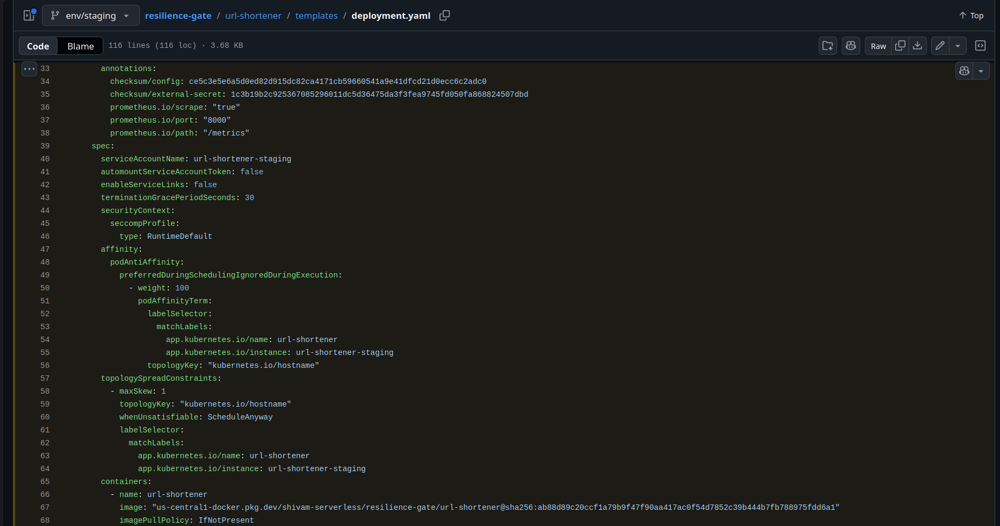

**Fresh release alignment.** The rendered `env/staging` Deployment shows
config/external-secret checksum annotations, hardened pod settings, and
application digest `sha256:ab88d89c…`. Captured **3 October, 15:18:24 UTC**.
The Secret name and checksum are references, not Secret contents.

### 14b · Render commit linkage

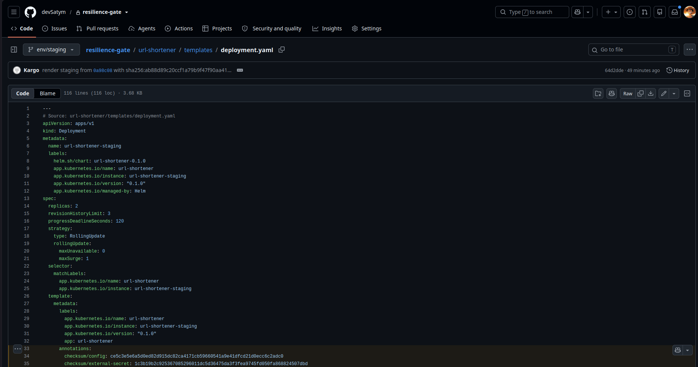

**Fresh release alignment.** This companion links the rendered file to
`env/staging`, the Kargo render message, and commit `64d2dde`. Captured
**3 October, 15:27:08 UTC**. Read together with 14 to connect content and revision.

### 29 · Fresh production-like resource tree

**Fresh release alignment.** Prod is `Healthy` / `Synced` at `7d334d5`, with
all 21 resources green and three application Pods Ready. Captured
**3 October, 17:22:51 UTC**. Its `15:34:59–15:35:29 UTC` AnalysisRun passed
readiness and liveness; this prod-like smoke requested no paid load or chaos.

## When the gate says no

### 13 · An unverified candidate cannot be selected for prod

**Historical candidate, later eligibility snapshot.** `intentional-liger`
(`a1bfd30…`) was verified only in dev and failed staging. Kargo v1.3 visibly
disables it for prod while eligible Freight remains selectable. Captured
**3 October, 04:50:25 UTC**. Selection was cancelled; no approval or Promotion
was submitted to create this evidence.

<strong>12–12b, 22 · Failed verification and its distinct telemetry</strong>

### 12 · Stage health is not release approval

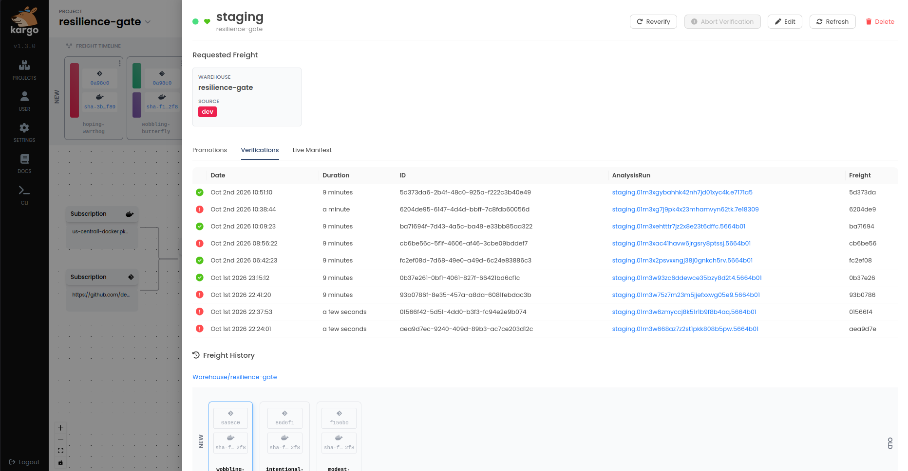

**Historical negative scenario.** The exact `intentional-liger` verification
failed during paid-traffic preflight at **2 October, 05:08:44–05:10:11 UTC**,
while the Stage's health indicators remained green. Captured **2 October,
20:08:47 UTC**. Failure stopped the run before fault injection.

### 12b · Readiness passed; chaos-verdict did not

**Same historical negative scenario as 12.** The detail view shows
`readiness` successful and `chaos-verdict` failed with its failure-limit
message. Captured **2 October, 20:15:43 UTC**.

### 22 · A separate historical failed fault/recovery run

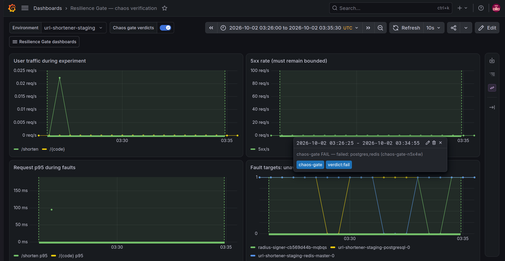

**Different historical negative scenario.** Freight `modest-wolf` has a
`chaos-gate FAIL — failed: postgres,redis` annotation covering
**2 October, 03:26:25–03:34:55 UTC**. Captured **3 October, 13:40:31 UTC**.
This earlier fault/recovery failure is not the preflight failure shown in 12.

## Recovery under real traffic

### 17 · Traffic, errors, latency, and recovery in one window

**Historical successful recovery scenario.** Freight `wobbling-butterfly`
used application digest `sha256:a5beda83…`. The absolute **2 October,
05:21:00–05:30:30 UTC** dashboard window correlates traffic, bounded 5xx,
route p95, and PostgreSQL/Redis/signer outage-and-recovery traces. Captured
**3 October, 12:50:58 UTC**. The green region represents the historical PASS
annotation, not a new execution at capture time.

<strong>15–16, 17b · Bounded k6 load, independent verdict, and application evidence</strong>

### 15 · Bounded load startup

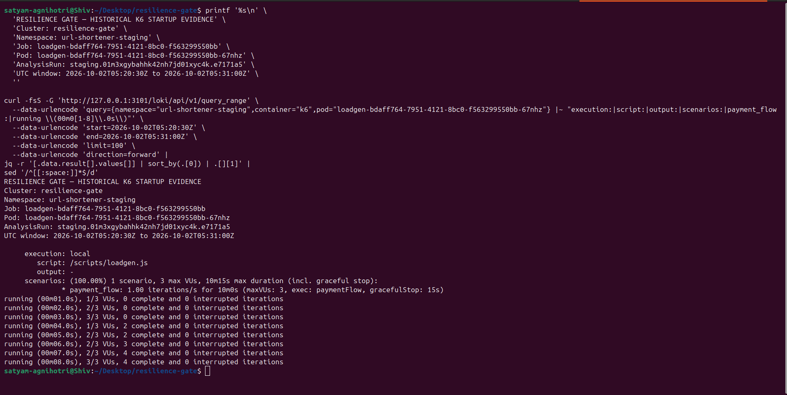

**Same historical recovery scenario.** Retained Loki metadata identifies the
exact load Job/Pod and a maximum of three VUs, one iteration per second, and
a ten-minute bound. Captured **3 October, 05:52:31 UTC**, from the retained
**2 October, 05:20:30–05:31:00 UTC** window.

### 16 · Load completion and gate result

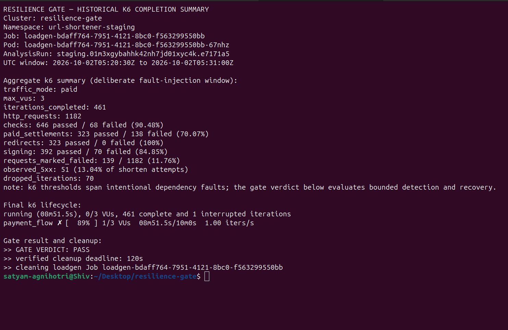

**Same historical recovery scenario.** Aggregate k6 counts include expected
fault-window errors. The independent `GATE VERDICT: PASS` and exact load Job
cleanup establish the gate result; a k6 exit or interrupted lifecycle line
alone would not. Captured **3 October, 05:57:32 UTC**.

### 17b · Zero application restarts and scoped logs

**Same historical recovery scenario and dashboard window as 17.** Application
restart series remain zero while scoped `/shorten` degradation, PASS, cleanup,
and bounded load excerpts are visible. Captured **3 October, 12:56:04 UTC**.
The restart claim is application-only; signer restarts are part of its fault test.

<strong>18–21 · Dependency-specific recovery and the exact PASS annotation</strong>

### 18 · PostgreSQL degradation and recovery

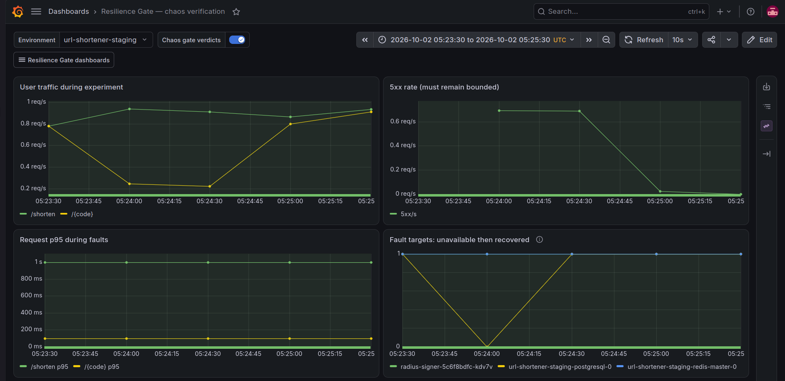

**Historical recovery; 2 October, 05:23:30–05:25:30 UTC.** PostgreSQL readiness
drops from `1` to `0`, then returns to `1` while traffic, bounded 5xx, and p95
remain visible. Captured **3 October, 13:03:52 UTC**.

### 19 · Redis fallback and recovery

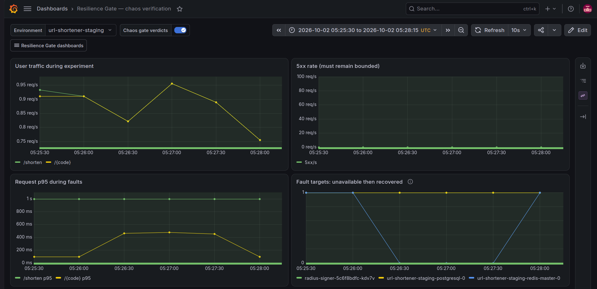

**Historical recovery; 2 October, 05:25:30–05:28:15 UTC.** Redis alone becomes
unavailable and recovers. Redirect latency rises during database fallback,
then recovers; traffic continues and 5xx stays zero. Captured **3 October,
13:10:50 UTC**.

### 20 · Signer recovery

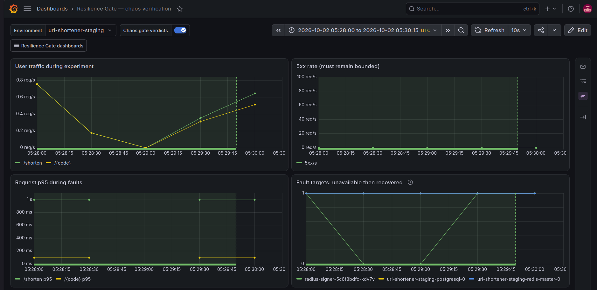

**Historical recovery; 2 October, 05:28:00–05:30:15 UTC.** Signer readiness
drops and recovers while PostgreSQL and Redis remain Ready, application
traffic recovers, and 5xx stays zero. Captured **3 October, 13:14:11 UTC**.

### 21 · The annotation identifies the verdict

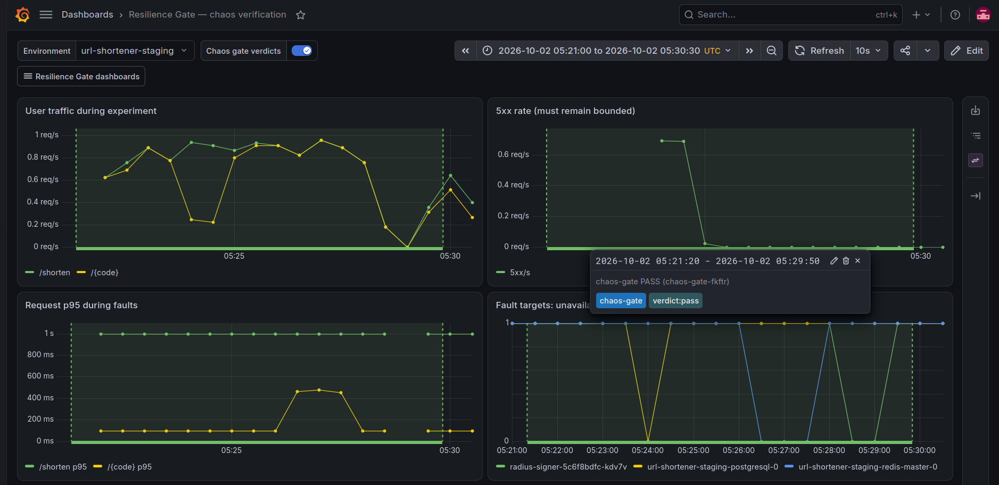

**Historical recovery.** The popup names `chaos-gate PASS (chaos-gate-fkftr)`
and `verdict:pass` over the exact **2 October, 05:21:20–05:29:50 UTC** interval.
Captured **3 October, 13:29:33 UTC**. This explicit verdict complements the
underlying AnalysisRun and scorecards; green graphs alone are insufficient.

## The paid request path

### 23 · Aggregate settlement and signer telemetry

**Historical successful recovery scenario; 2 October, 05:21:00–05:30:30 UTC.**
Populated payment/facilitator metrics show `100%` settlement success and zero
replay attempts within that window. Signer and wallet-readiness panels use
address-removed aggregates. Captured **3 October, 13:49:25 UTC**. Zero replay
attempts here is distinct from the explicit replay-rejection smoke below.

<strong>24–25 · Challenge, settlement, replay rejection, and Permit2 readiness</strong>

### 24 · The paid-smoke status sequence

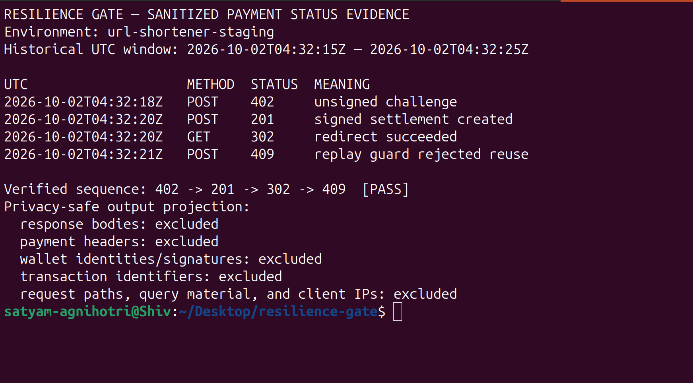

**Separate historical paid smoke.** Retained access metadata records the
ordered `402 → 201 → 302 → 409` sequence during **2 October,
04:32:15–04:32:25 UTC** for `modest-wolf`. Captured **3 October, 13:57:16 UTC**.
The renderer validates ordering and excludes bodies, payment headers,
wallet identities, signatures, transaction identifiers, and client IPs.

### 25 · Signer and Permit2 readiness

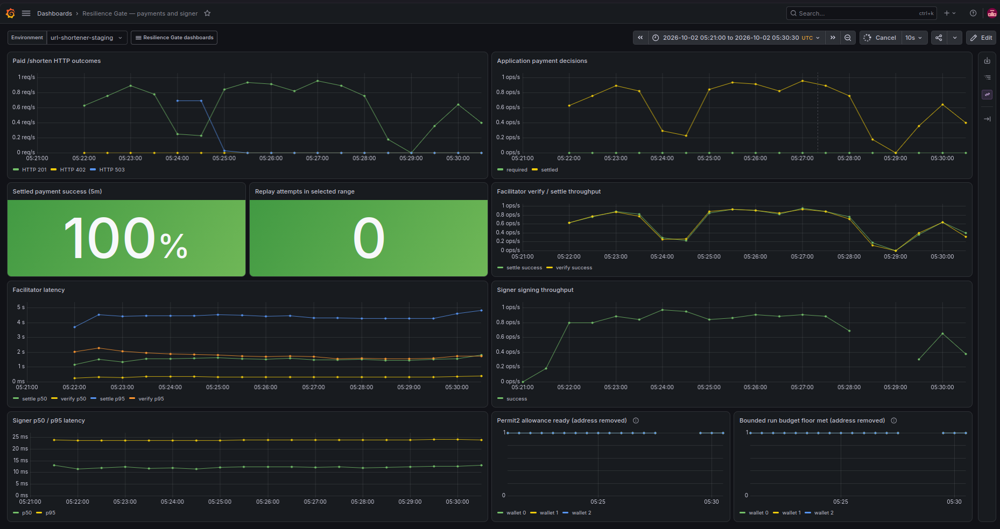

**Historical recovery scenario; 2 October, 05:21:00–05:30:30 UTC.** Successful
signer throughput and latency appear beside allowance/budget readiness `1`
for `wallet_index` `0`, `1`, and `2`. Captured **3 October, 14:05:06 UTC**.
These labels do not expose addresses or balances; readiness does not itself
prove an individual settlement.

## Cleanup is part of the result

### 26 · No orphaned experiment at the audited boundary

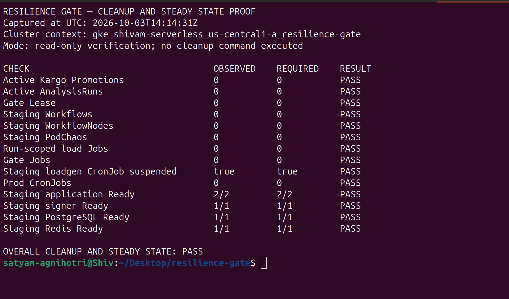

**Pre-alignment live snapshot; 3 October, 14:14:31 UTC.** The audit reports
zero active Promotions, AnalysisRuns, gate/load Jobs, Lease, and Chaos Mesh
objects; the staging source CronJob is suspended and workloads are Ready.
Captured **3 October, 14:15:01 UTC**, before the fresh release validation
started. Final cleanup for the later fresh staging/prod runs is recorded
separately in the [verification report](../verification-report.md).

## Integrity, privacy, and legacy replacement

The [manifest](manifest.json) records each accepted file's SHA-256, capture
time, observed window, scenario, identities, and narrow visible proof. It
contains exactly these 34 reviewed images. Five filenames ending in `b` are
detail companions: `04b`, `05b`, `12b`, `14b`, and `17b`.

The recapture set replaces the old Argo overview/tree, Kargo pipeline and
verification, rendered-manifest, k6, chaos-dashboard, verdict, payment, and
signer screenshots. The earlier manual-warning modal is retired: the deployed
Kargo v1.3 UI instead disables the ineligible Freight, as shown in 13. The old
payment-flow illustration is architecture material and belongs in the
[diagram collection](../diagrams/README.md). Duplicate aliases and the
mislabeled legacy Grafana duplicate are excluded from this gallery.
The [retired-asset map](retired-assets.md) documents all 24 removed legacy
files, their replacements, and the private recovery-archive boundary.

Images were reviewed to exclude personal email, credentials, Secret values,
wallet addresses, signatures, payment headers, and transaction identifiers.
Public repository names, resource metadata, and the owner-approved local
terminal username may appear. The manifest omits local UI access endpoints
and credential-retrieval instructions. See [known limitations](../known-limitations.md)
for the production and independent-verification boundaries.
